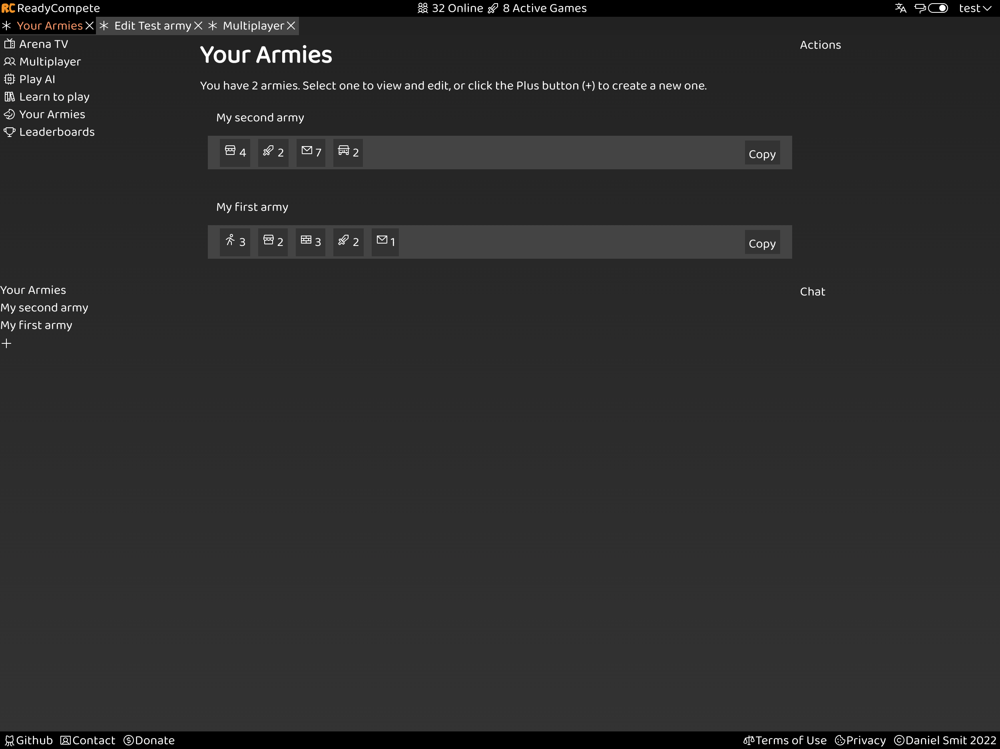
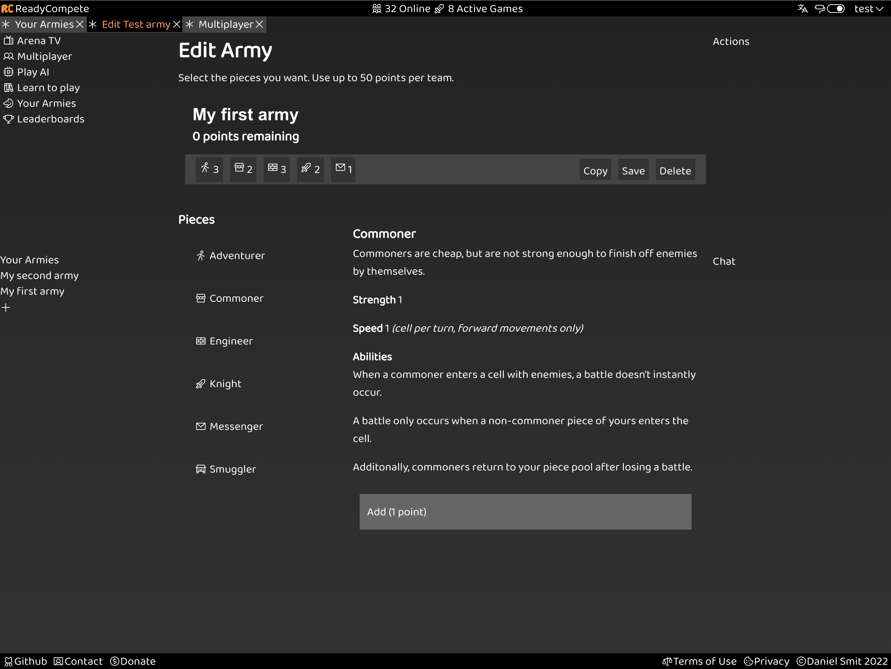
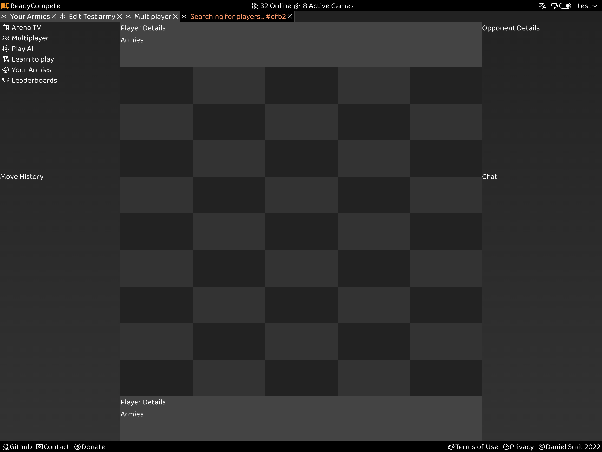

# ReadyCompete

A strategic capture the flag board game with custom user designed armies.

This is still in development. You can see the live version at [ReadyCompete.com](https://readycompete.com).

Created using React and AWS Amplify.

**Requirements**:
* Create an AWS account
* AWS Amplify CLI
* npm and Node.js

## Usage

Setup and install project dependencies
```bash
npm install
```

Configure AWS/Amplify
```bash
amplify configure
```

Push changes
```bash
amplify push
```

Generate a local mock API
```bash
amplify mock api
```

Start a local development server
```bash
npm start
```

Other available commands are
```bash
npm build # Build for production
npm test # Run tests
npm run lint # Reports code not adhering to eslint config
npm run lint-and-fix # Automatically fixes code not adhering to eslint config
```

## Screenshots

[](documentation/images/armies-page.png)
An overview of each of your armies. Select from any of your existing armies when initiating a new game.

[](documentation/images/edit-army-page.png)
Use up to 50 points to select pieces for your army. Select pieces to implement your unique strategies.

[](documentation/images/play-game-page.png)
Players will face off against each other with their custom armies on a 1D or 2D board with various custom game settings.